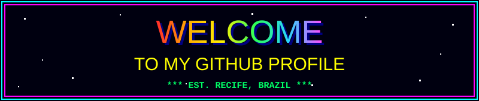

  
  
I'm <strong>João Filipe Reis</strong>, iOS Software Engineer from Recife, Brazil.

- Software Engineering Intern (iOS) at **MachLev**, working on [Gradepen](https://apps.apple.com/br/app/gradepen/id654152733)
- **Swift Student Challenge 2025** winner with [IKnowEarth](https://github.com/ReisLipe/IKnowEarth)
- Apple Developer Academy alumnus
- Computer Engineering student at the University of Pernambuco (UPE)

  

<table align="center">
<tr>
<td align="center"><a href="https://www.linkedin.com/in/jfrjs/"><strong>LinkedIn</strong></a></td>
<td align="center"><a href="https://medium.com/@reislipe"><strong>Medium</strong></a></td>
<td align="center"><a href="mailto:joaofreisjs@gmail.com"><strong>E-mail</strong></a></td>
</tr>
</table>

    
  

